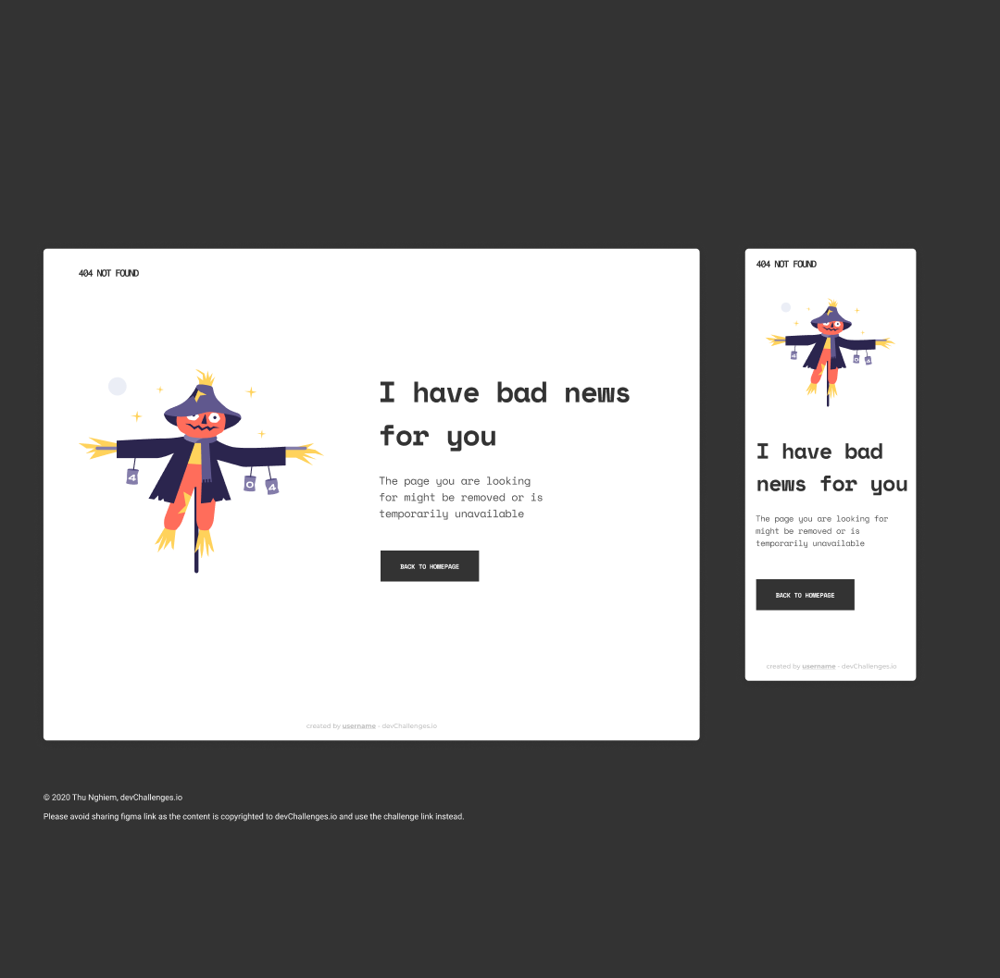

<!-- Please update value in the {}  -->

<h1 align="center">{404 NOT FOUND}</h1>

<!-- TABLE OF CONTENTS -->

## Table of Contents

- [Overview](#overview)
  - [Built With](#built-with)
- [Features](#features)
- [Contact](#contact)
- [Acknowledgements](#acknowledgements)

<!-- OVERVIEW -->

## Overview

Introduce your projects by taking a screenshot or a gif. Try to tell visitors a story about your project by answering:

- done using css grid for the layout and flexbox for the individual div responsiveness

### Built With

- [HTML](https://w3schools.com/html)
- [CSS](https://w3schools.com/css)

## Features

This site was created as a submission to a [DevChallenges](https://devchallenges.io/challenges) challenge. The [challenge](https://devchallenges.io/challenges/wBunSb7FPrIepJZAg0sY) was to build a 404 NOT FOUND Landing Page.

## Acknowledgements

- [Steps to replicate a design with only HTML and CSS](https://devchallenges-blogs.web.app/how-to-replicate-design/)

## Contact

- GitHub [@YomaAroriode](https://{github.com/YomaAroriode})
